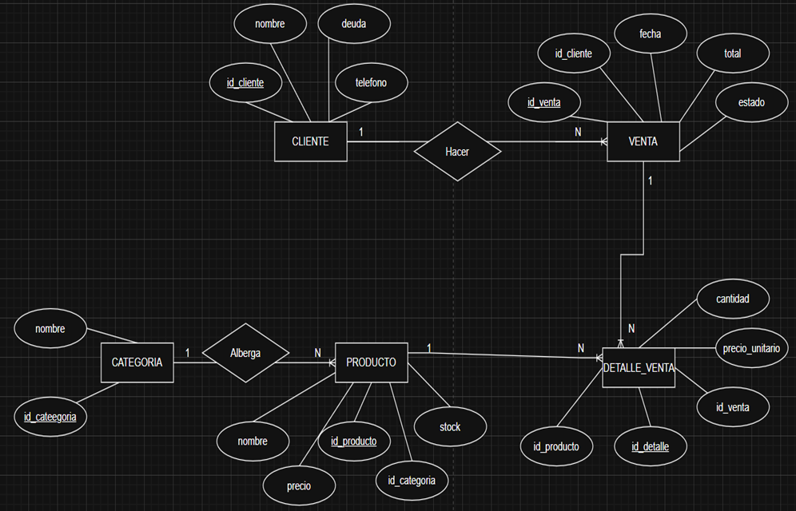
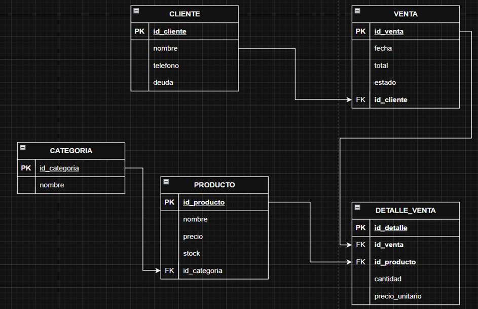

## Descripcion del negocio
Nombre: Bodega Monica  
Tamaño: Pequeña empresa, operacion individual o familiar  
Contexto: Negocio muy comun en el Peru en el cual compran productos de primera
necesidad (alimentos, limpieza, bebidas) al por mayor
para venderlos por unidad al consumidor final.  
Justificacion: Se necesita un sistema digital que faciliter sumar el monto de la venta que hasta ahoras se realiza de forma manual un cuaderno, para asi evitar errores al monto que el cliente haga su compra.

## Identificar el problema y solución
Problema: La vendedora lleva a cabo la cuenta de sus ventas del día en un cuaderon o papel, lo que genera errores, como confución al momentote de realizar la suma de la venta, dificultad para saber si estada dando el vulto correspondiente.  
Solucion tecnologica: Desarrollar un sistema web con Java Spring Boot y MySQL que permita registrar clientes, mostrar la el monto total de la venta automaticamente, asignar si el pago si se realizo o esta pendiente.

## Requerimientos Funcionales
| Codigo | Descripcion |
|---|---|
| RF01 | El sistema debe permitir registrar clientes con sus datos básicos (DNI, nombre, teléfono). |
| RF02 | El sistema debe permitir el registro, edición y eliminación de productos |
| RF03 | El sistema debe permitir elegir entre pago en "Efectivo" o "Fiado" |
| RF04 | El sistema debe descontar automáticamente las unidades vendidas del stock del producto |
| RF05 | El sistema debe registrar ventas seleccionando productos y calculando el total automáticamente |

## Requerimientos No Funcionales
 
| Codigo | Tipo | Descripcion |
|---|---|---|
| RNF01 | Rendimiento | El sistema debe procesar el registro de una venta y generar la respuesta en menos de 2 segundos. |
| RNF02 | Usabilidad | La interfaz debe ser simple y fácil de usar, pensada para una navegación rápida |
| RNF03 | Seguridad | El sistema debe requerir un usuario y contraseña para acceder a la gestión de inventario y deudas. |

## Stack completo
1. Trello             = Gestión del proyecto (Kanban)
2. Draw.io            = Diagrama ER + Diagrama de Clases
3. Figma              = Wireframe + Diseño UI/UX
4. MySQL Workbench    = Diseñar y administrar BD
5. IntelliJ           = Frontend (HTML,CSS,JS) + Backend (Spring Boot)
6. XAMPP              = Servidor Tomcat para correr la app

## Tecnologias utilizadas
- Java 17
- Spring Boot 3
- MySQL 8
- HTML5, CSS3, JavaScript
- IntelliJ IDEA
- XAMPP (Tomcat)
- MySQL Workbench
- Figma (diseño UI/UX)
- Draw.io (diagramas)

## Base de datos
 
El sistema cuenta con 4 tablas principales:
 
| Tabla | Descripcion |
|---|---|
| PRODUCTO | Donde se realiza la consulata con el inventario y su costo. |
| CLIENTE | Personas que solicitan la compra |
| VENTA | Registro de cada producto seleccionado |
| DETALLE_VENTA | Para saber qué productos se llevaron en una sola venta |

### Diagrama Entidad-Relacion (DER)

### Modelo Relacional (MR)
