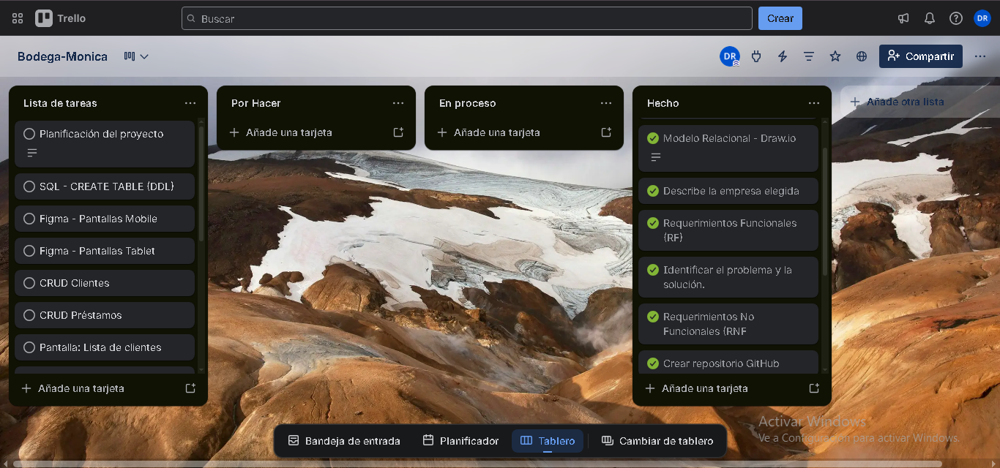
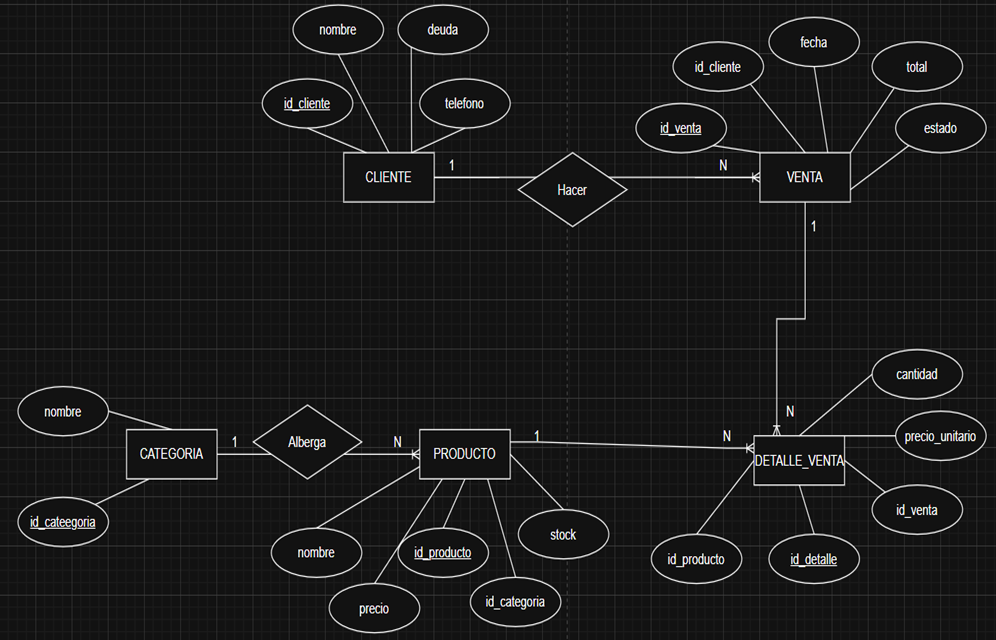
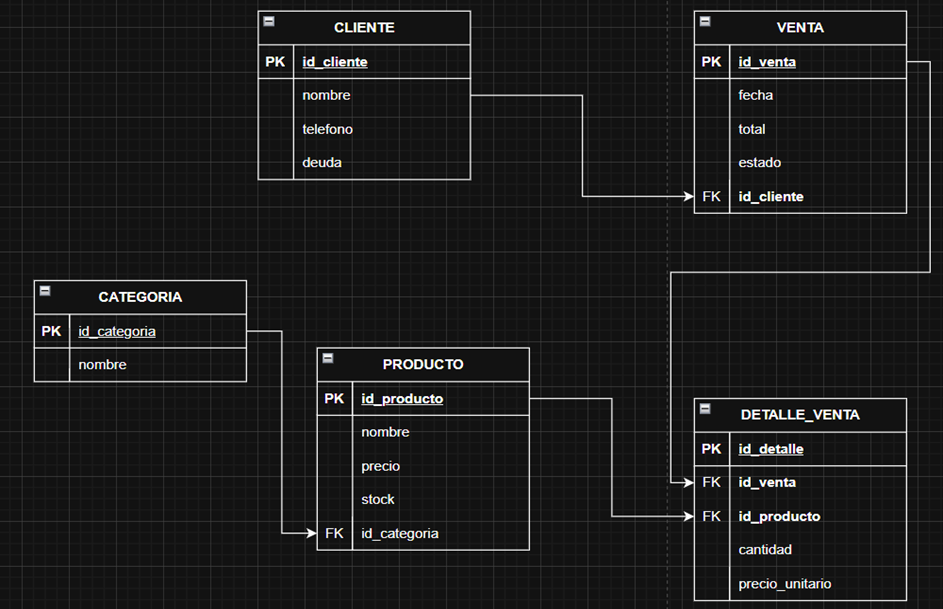

## TRELLO
Más info en [mi tablero de trello](https://trello.com/b/YnIg8VUR/bodega-monica)


---

## Descripcion del negocio
Nombre: Bodega Monica <br>
Tamaño: Pequeña empresa, operacion individual o familiar <br>
Contexto: Negocio muy comun en el Peru en el cual compran productos de primera
necesidad (alimentos, limpieza, bebidas) al por mayor
para venderlos por unidad al consumidor final. <br>
Justificacion: Se necesita un sistema digital que faciliter sumar el monto de la venta que hasta ahoras se realiza de forma manual un cuaderno, para asi evitar errores al monto que el cliente haga su compra.

## Identificar el problema y solución
Problema: La vendedora lleva a cabo la cuenta de sus ventas del día en un cuaderon o papel, lo que genera errores, como confución al momentote de realizar la suma de la venta, dificultad para saber si estada dando el vulto correspondiente. <br>
Solucion tecnologica: Desarrollar un sistema web con Java Spring Boot y MySQL que permita registrar clientes, mostrar la el monto total de la venta automaticamente, asignar si el pago si se realizo o esta pendiente.

## Requerimientos Funcionales
| Codigo | Descripcion |
|---|---|
| RF01 | El sistema debe permitir registrar clientes con sus datos básicos (DNI, nombre, teléfono). |
| RF02 | El sistema debe permitir el registro, edición y eliminación de productos |
| RF03 | El sistema debe permitir elegir entre pago en "Efectivo" o "Fiado" |
| RF04 | El sistema debe descontar automáticamente las unidades vendidas del stock del producto |
| RF05 | El sistema debe registrar ventas seleccionando productos y calculando el total automáticamente |

## Requerimientos No Funcionales
 
| Codigo | Tipo | Descripcion |
|---|---|---|
| RNF01 | Rendimiento | El sistema debe procesar el registro de una venta y generar la respuesta en menos de 2 segundos. |
| RNF02 | Usabilidad | La interfaz debe ser simple y fácil de usar, pensada para una navegación rápida |
| RNF03 | Seguridad | El sistema debe requerir un usuario y contraseña para acceder a la gestión de inventario y deudas. |

## Stack completo
1. Trello             = Gestión del proyecto (Kanban)
2. Draw.io            = Diagrama ER + Diagrama de Clases
3. Figma              = Wireframe + Diseño UI/UX
4. MySQL Workbench    = Diseñar y administrar BD
5. IntelliJ           = Frontend (HTML,CSS,JS) + Backend (Spring Boot)
6. XAMPP              = Servidor Tomcat para correr la app

## Tecnologias utilizadas
- Java 17
- Spring Boot 3
- MySQL 8
- HTML5, CSS3, JavaScript
- IntelliJ IDEA
- XAMPP (Tomcat)
- MySQL Workbench
- Figma (diseño UI/UX)
- Draw.io (diagramas)

## Base de datos
 
El sistema cuenta con 4 tablas principales:
 
| Tabla | Descripcion |
|---|---|
| PRODUCTO | Donde se realiza la consulata con el inventario y su costo. |
| CLIENTE | Personas que solicitan la compra |
| VENTA | Registro de cada producto seleccionado |
| DETALLE_VENTA | Para saber qué productos se llevaron en una sola venta |

## Estructura del proyecto
 
```
Java-Web-Bodega-Monica/
├── backend/          → Spring Boot (Java)
│   ├── src/
│   ├── pom.xml
│   └── ...
├── frontend/         → HTML, CSS, JS
│   ├── css/
│   ├── js/
│   └── index.html
```
---

### Diagrama Entidad-Relacion (DER)


### Modelo Relacional (MR)


### Cardinalidades
CLIENTE — VENTA (1:N) <br>
Un cliente puede tener muchas ventas a su nombre, pero una venta solo tiene un ciente. <br>
PRODUCTO — DETALLE_VENTA (1:N) <br>
Un producto puede estar en muchos detalles de distintas ventas, pero en un detalles venta no se repite el mismo nombre del producto. <br>
VENTA — DETALLE_VENTA (1:N) <br>
Una venta continene muchos detalles de la venta, pero detalles venta solo contiene una venta.

| Entidad A | Relacion | Entidad B | Cardinalidad |
|---|---|---|---|
| CLIENTE | tiene | VENTA | 1:N |
| PRODUCTO | aparece | DETALLE_VENTA | 1:N |
| VENTA | contiene | DETALLE_VENTA | 1:N |

### Base de datos
 
El sistema cuenta con 4 tablas principales:

```sql
CREATE TABLE clientes (
    id_cliente INT AUTO_INCREMENT PRIMARY KEY,
    nombre VARCHAR(100) NOT NULL,
    apellido VARCHAR(100) NOT NULL,
    dni VARCHAR(8) NOT NULL UNIQUE,
    telefono VARCHAR(15),
    direccion VARCHAR(255)
)ENGINE=InnoDB
  DEFAULT CHARSET=utf8mb4
  COLLATE=utf8mb4_spanish_ci;

CREATE TABLE productos (
    id_producto  INT PRIMARY KEY AUTO_INCREMENT,
    nombre       VARCHAR(100)  NOT NULL,
    categoria    VARCHAR(80)   NOT NULL,    
    precio       DECIMAL(10,2) NOT NULL,
    stock        INT           DEFAULT 0
) ENGINE=InnoDB
  DEFAULT CHARSET=utf8mb4
  COLLATE=utf8mb4_spanish_ci;
  
INSERT INTO productos (nombre, categoria, precio, stock) VALUES
('Yogurt Gloria 1L',  'Lacteos', 10.00, 15),
('Cuate',    'Snacks', 1.00, 20),
('Filete de atún',   'Conservas', 6.50, 30),
('Vino Dulce 1L',   'Bebidas Alcoholicas', 16.00, 35),
('Suavizante Dest Floral 1.5L', 'Limpieza', 14.00, 20);
  
  CREATE TABLE ventas (
    id_venta    INT	AUTO_INCREMENT PRIMARY KEY,
    total      DECIMAL(10,2) NOT NULL,
    fecha_venta DATETIME	NOT NULL,
    estado    VARCHAR(20)	NOT NULL,
    id_cliente	INT,
	FOREIGN KEY (id_cliente) REFERENCES clientes (id_cliente)
) ENGINE=InnoDB
  DEFAULT CHARSET=utf8mb4
  COLLATE=utf8mb4_spanish_ci;
  
  CREATE TABLE detalle_venta (
  id_detalle INT AUTO_INCREMENT PRIMARY KEY,
  cantidad INT NOT NULL,
  precio_venta DECIMAL(10,2),
  id_venta INT,
  id_producto INT,
  FOREIGN KEY (id_venta) REFERENCES ventas (id_venta),
  FOREIGN KEY (id_producto) REFERENCES productos (id_producto)
  )ENGINE=InnoDB
  DEFAULT CHARSET=utf8mb4
  COLLATE=utf8mb4_spanish_ci;


```

---

### Requisitos previos
- Tener instalado IntelliJ IDEA
- Tener instalado XAMPP (para MySQL)
- Tener instalado MySQL Workbench
- Tener instalado JDK 21 o superior
 
### Backend
1. Abrir la carpeta `backend/` en IntelliJ IDEA
2. Configurar `application.properties` con los datos de MySQL
3. Iniciar XAMPP y activar MySQL
4. Ejecutar `BodegamonicaApplication.java`
5. El backend corre en: `http://localhost:8080`
 
### Frontend
1. Abrir la carpeta `frontend/` en VsCode
2. Abrir `index.html` con Live Server
3. El frontend se comunica con el backend via fetch()

> El frontend y el backend corren por separado.
> El backend debe estar iniciado antes de abrir el frontend.
 
### Configuracion de base de datos
```
spring.application.name=gotagota
# CONEXION A MYSQL
spring.datasource.url=jdbc:mysql://localhost:3306/bodega_monica
spring.datasource.username=root
spring.datasource.password=
spring.datasource.driver-class-name=com.mysql.cj.jdbc.Driver

#JPA / HIBERNATE
spring.jpa.hibernate.ddl-auto=update
spring.jpa.show-sql=true
spring.jpa.properties.hibernate.dialect=org.hibernate.dialect.MySQLDialect

# Puerto del servidor
server.port=8080

```